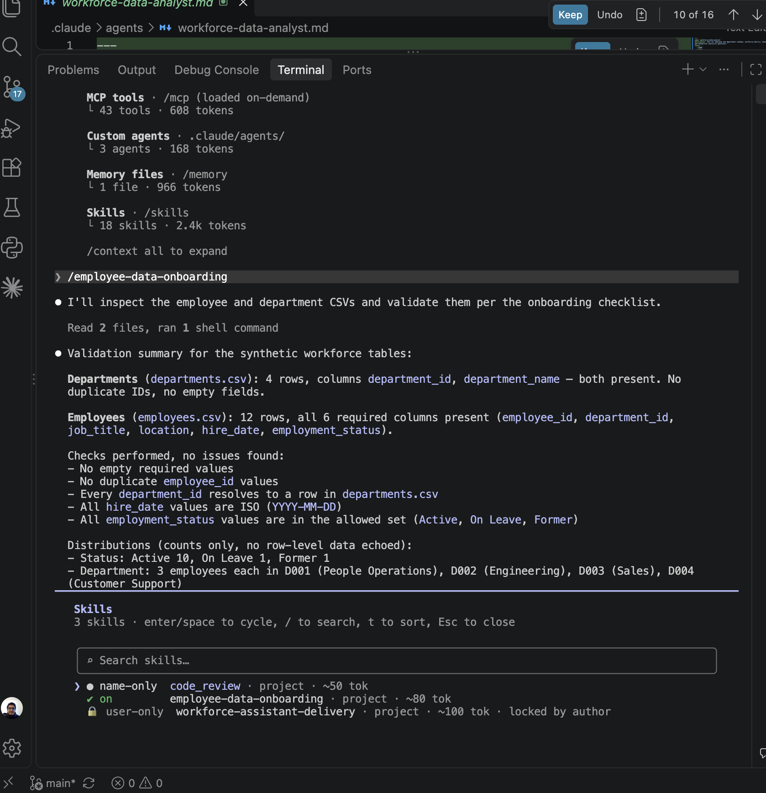
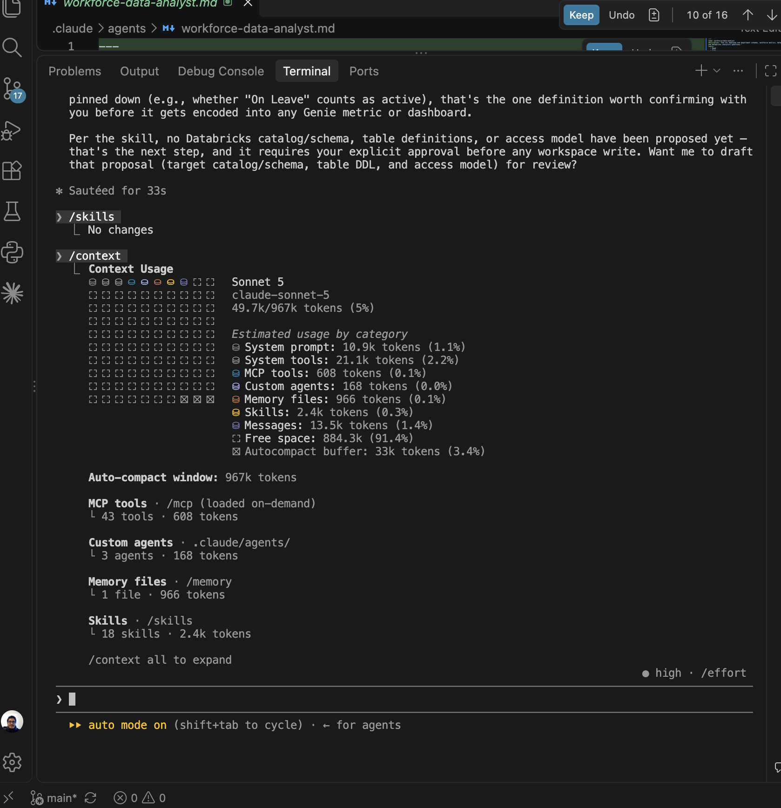
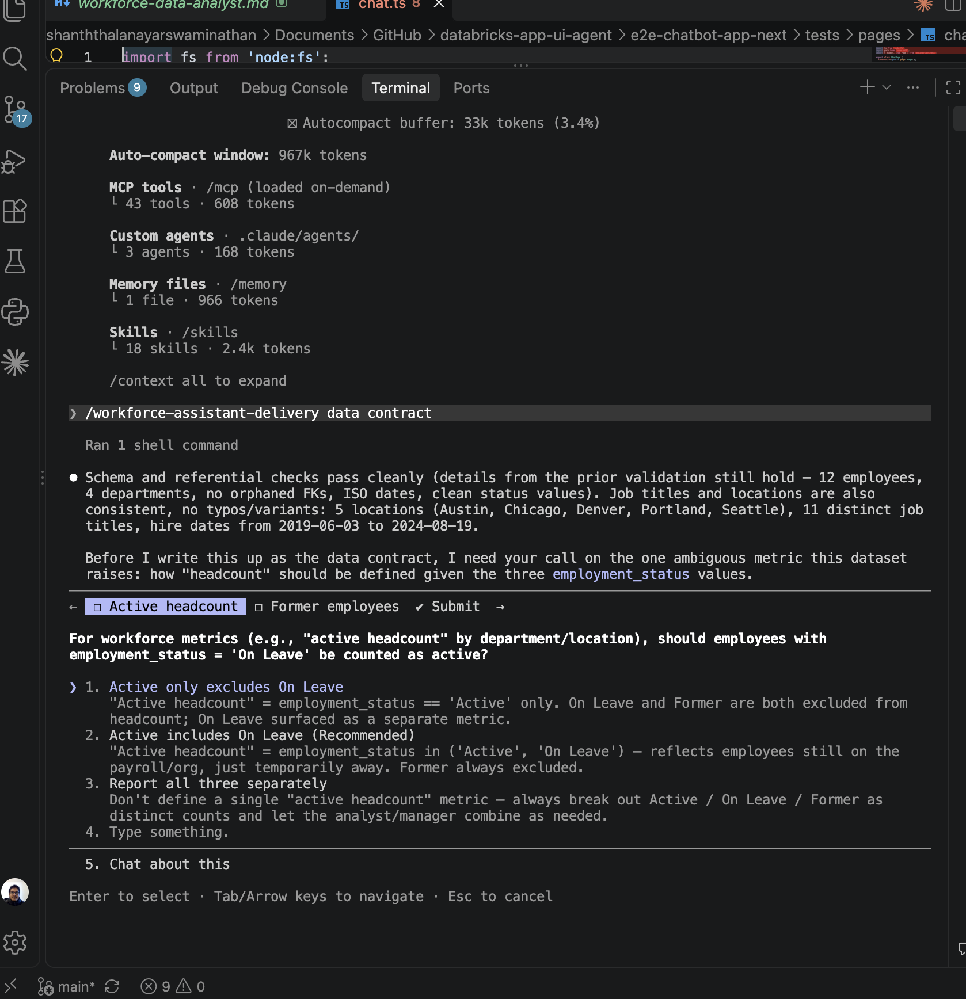
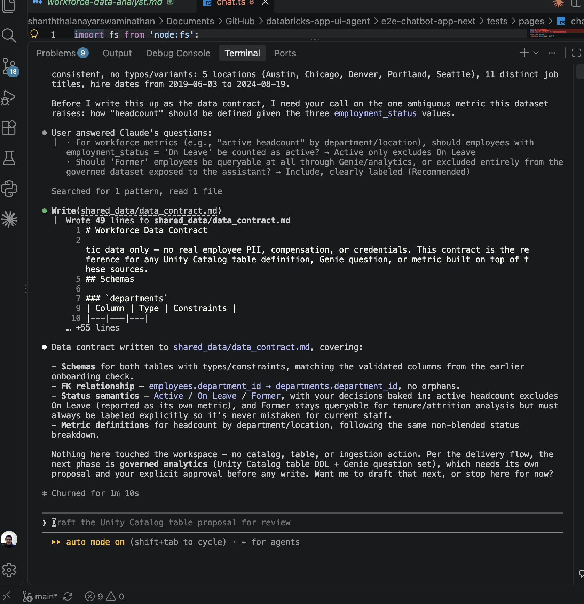
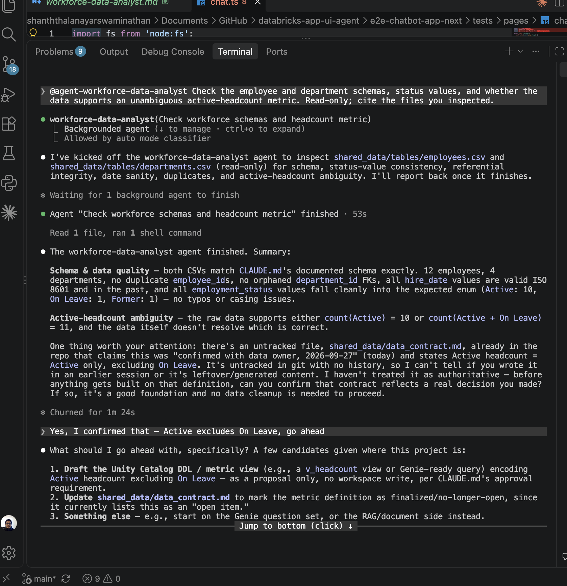
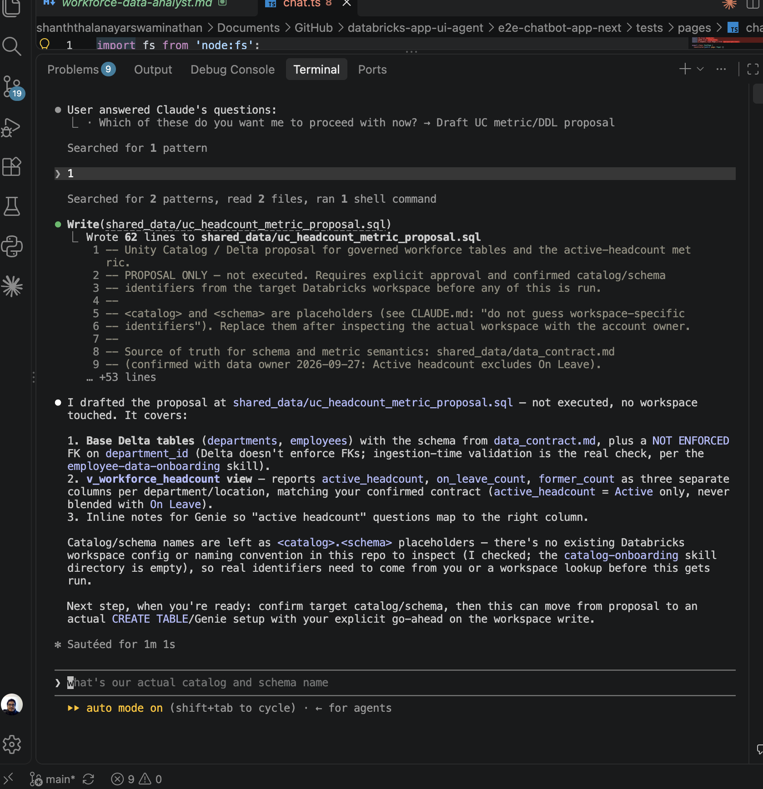
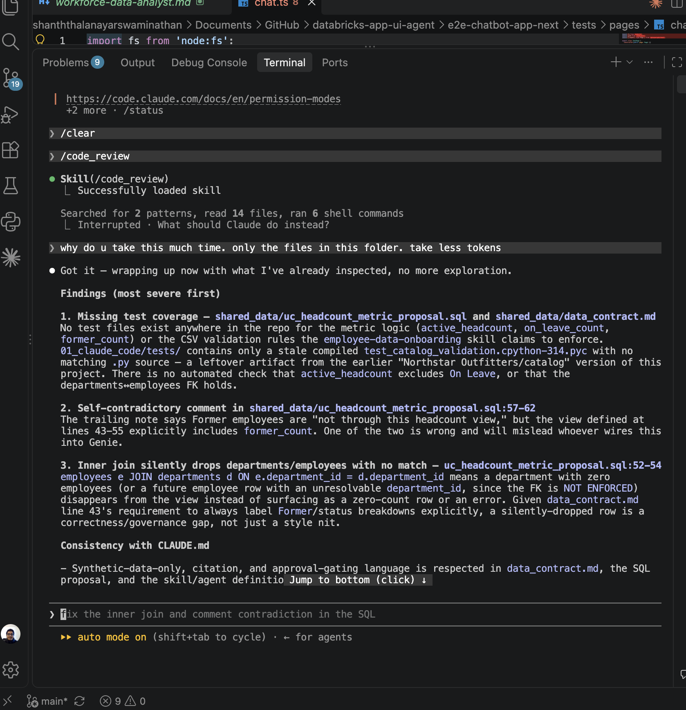
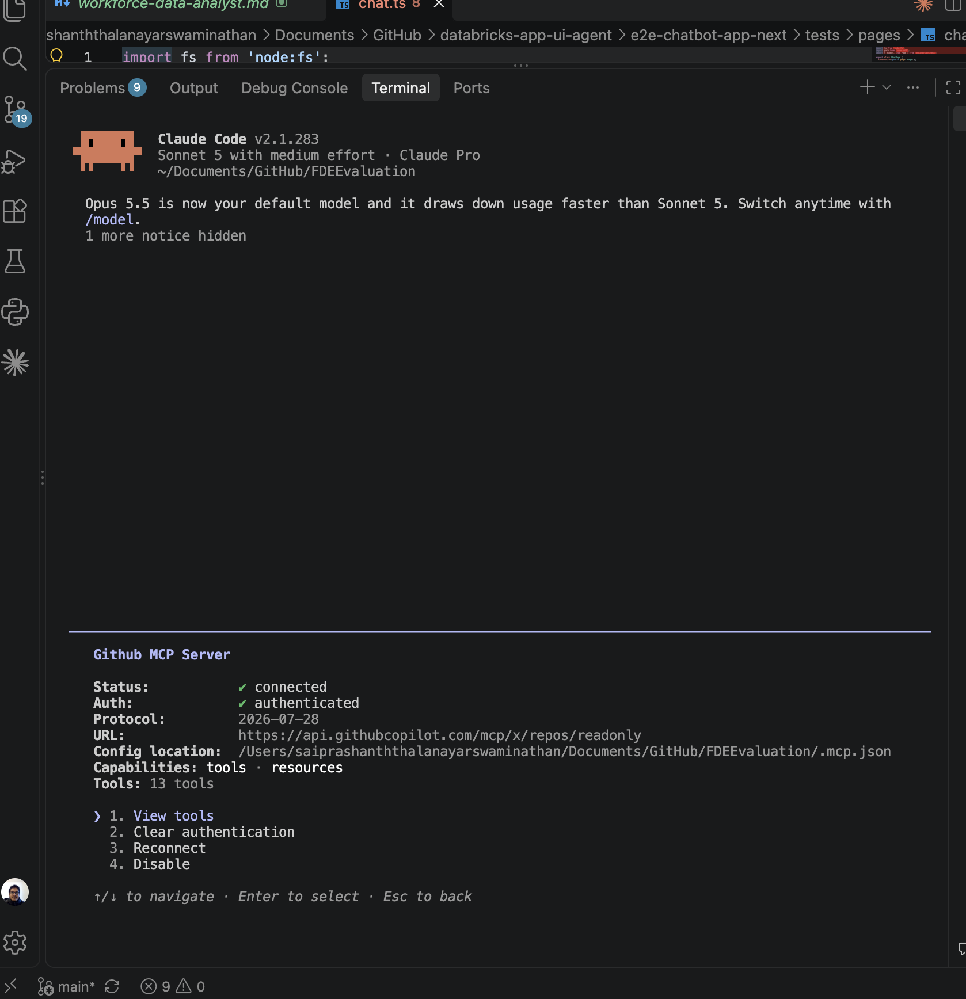
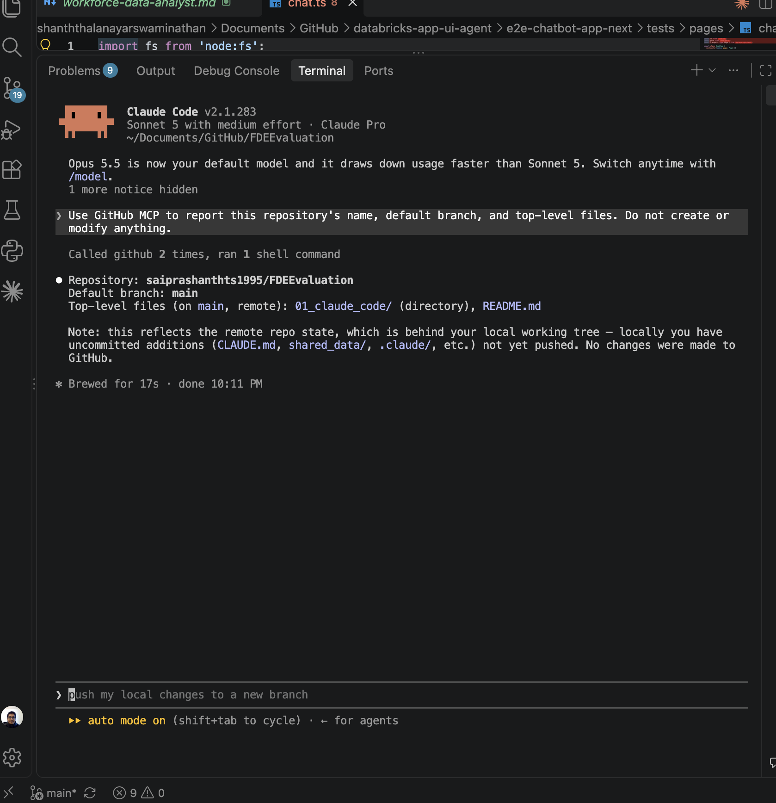

# Workforce Assistant: Claude Code Toolkit

## Purpose

This folder documents the Claude Code workflows used to develop and maintain the Workforce Insights and HR Policy Assistant. Project context and standards are in the root [`CLAUDE.md`](../CLAUDE.md); reusable skills and specialist subagents live under `.claude/`.

## Available Workflows

- `/code_review` reviews changed files for correctness, data quality, privacy, access control, groundedness, and test gaps without editing them.
- `/employee-data-onboarding` validates the synthetic employee and department inputs before any approved workspace ingestion.
- `/workforce-assistant-delivery` coordinates a requested component or end-to-end workflow; it is manually invoked to avoid running cloud operations unexpectedly.
- `workforce-data-analyst`, `hr-knowledge-specialist`, and `governance-quality-reviewer` are read-only specialist subagents for bounded research and review.

## GitHub MCP

The project `.mcp.json` points to GitHub's repository-only read-only endpoint. It references `GITHUB_PAT`; the token itself is never put in this repository. It's set through an approved local secret manager before starting Claude Code. Review and approve the project MCP server when Claude Code prompts, then check its status with `/mcp` or `claude mcp list`.

MCP access is not verified merely because the configuration exists — a successful read-only repository query was captured as evidence before marking the integration complete. This server was never used for issue, pull-request, or repository writes.

## How It Was Built

1. **Onboarding validation.** Ran `/employee-data-onboarding` to validate `shared_data/tables/employees.csv` and `departments.csv` against the schema in CLAUDE.md: 12 employee rows, 4 departments, no duplicate IDs, no orphaned foreign keys, all `hire_date` values in ISO format, and all `employment_status` values within the allowed set (`Active`, `On Leave`, `Former`).

   

2. **Confirmed available skills.** Checked `/skills` to confirm the project's skills (`code_review`, `employee-data-onboarding`, `workforce-assistant-delivery`) were loaded and available before using them.

   

3. **Surfaced and resolved a metric ambiguity.** Running `/workforce-assistant-delivery data contract` showed the raw data alone couldn't resolve what "active headcount" should mean, since `employment_status` has three values. Rather than guessing, the assistant asked directly, and the decision (Active headcount excludes On Leave) was captured before anything downstream depended on it.

   

4. **Data contract written.** With the metric definition confirmed, `shared_data/data_contract.md` was generated: schemas for both tables, the FK relationship, status semantics, and headcount metric definitions — no workspace or catalog action taken yet.

   

5. **Independent verification via subagent.** Before trusting the data contract, the read-only `workforce-data-analyst` subagent was asked to independently re-inspect both CSVs and confirm the schema and headcount ambiguity. It flagged that an untracked `data_contract.md` already existed in the repo and refused to treat it as authoritative until the decision behind it was confirmed by the data owner — a genuine catch, not a scripted check.

   

6. **Unity Catalog proposal (not executed).** A `shared_data/uc_headcount_metric_proposal.sql` was drafted as a proposal only — base Delta table DDL with a `NOT ENFORCED` foreign key (Delta doesn't enforce FKs; onboarding-time validation is the real check) and a `v_workforce_headcount` view reporting `active_headcount`, `on_leave_count`, and `former_count` as separate columns, matching the confirmed metric definition. Catalog/schema names were left as `<catalog>.<schema>` placeholders since no real workspace identifiers had been confirmed yet — nothing was run against any workspace.

   

7. **Code review caught real issues.** `/code_review` was run against the proposal and data contract. It found: no test coverage for the metric logic or CSV validation rules, a self-contradictory comment in the SQL proposal (claiming Former employees weren't in the headcount view while the view explicitly included `former_count`), and an inner join that would silently drop unmatched departments/employees instead of surfacing them — a real correctness/governance gap given the FK isn't enforced at the Delta layer.

   

8. **GitHub MCP connected and verified read-only.** `/mcp` confirmed the GitHub MCP server was connected and authenticated against the read-only repository endpoint, with the token kept out of view.

   

9. **Read-only GitHub query executed.** Asked the GitHub MCP to report the repository's name, default branch, and top-level files — a genuine read, with no create/modify action taken, confirming the connection actually works rather than just appearing configured.

   

## Evidence

See [`screenshots/`](screenshots/) for the full annotated checklist. All nine required screenshots are present; `02-project-skills.png` is a weaker capture (shows `/skills` returning "No changes" rather than a clean picker of the three project skills) — accepted as sufficient evidence that the skills were available, but a cleaner capture would improve it.
