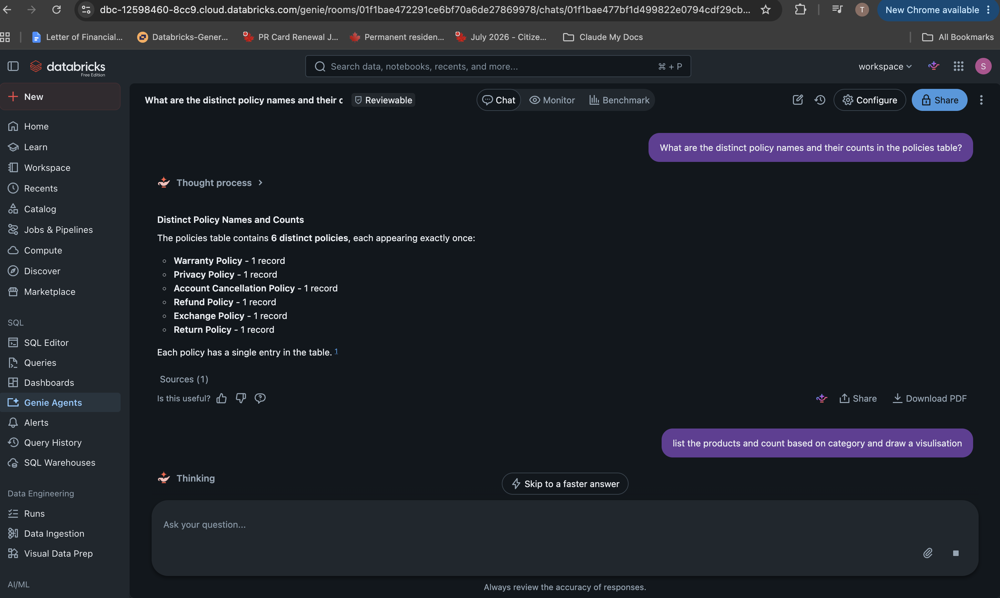
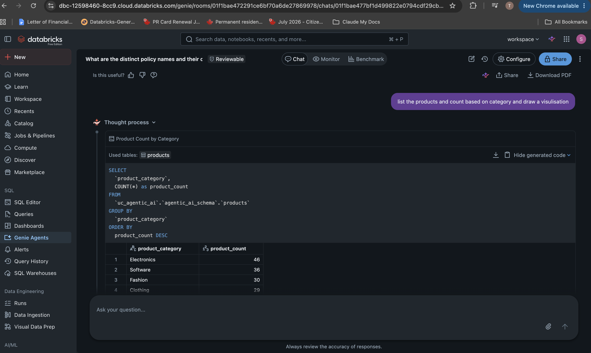
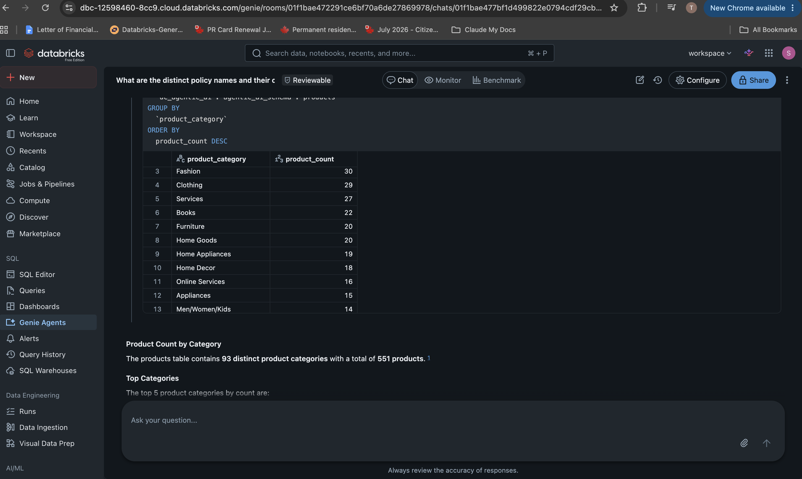
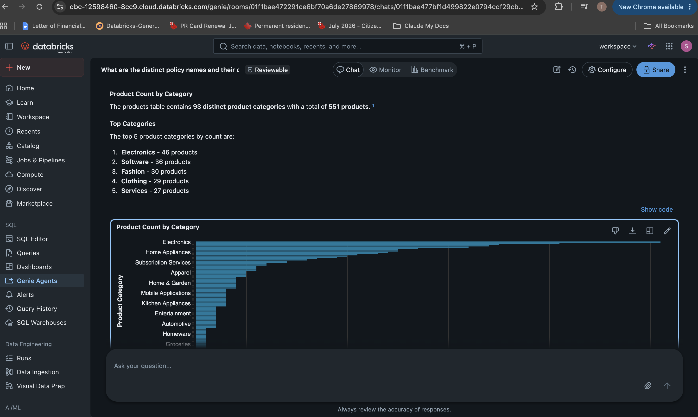
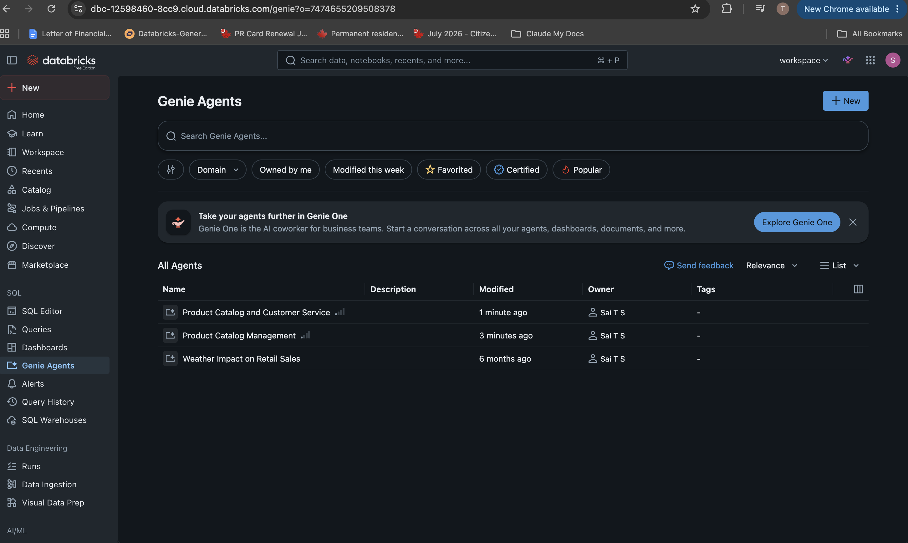
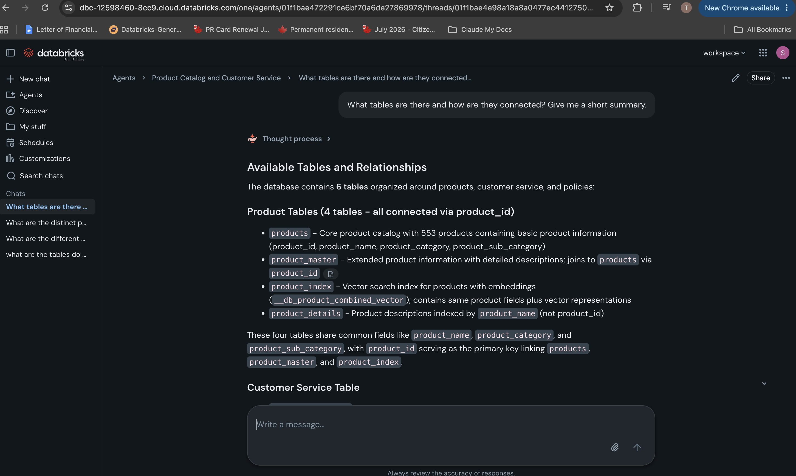

# Databricks Genie Space: Product Catalog and Customer Service

## Purpose

This assignment builds a Databricks Genie Space for natural-language analytics. It deliberately uses a different use case from the Workforce Insights assistant in [`01_claude_code/`](../01_claude_code/) and the root [`CLAUDE.md`](../CLAUDE.md) — instead of ingesting new data, it reuses Unity Catalog tables that already existed in the workspace, to demonstrate discovery + governed analytics over existing assets.

## Data Source

Inspected read-only via the Unity Catalog REST API (`/api/2.1/unity-catalog/catalogs|schemas|tables`) before building anything, per this repo's engineering standard of not guessing workspace-specific identifiers.

Catalog: `uc_agentic_ai` · Schema: `agentic_ai_schema`

| Table | Columns | Role |
|---|---|---|
| `products` | product_id, product_name, product_category, product_sub_category | Core product catalog (551 products, 93 categories) |
| `product_master` | product_id, product_name, product_category, product_sub_category, product_desc, product_combined | Extended product info, joins to `products` on `product_id` |
| `product_details` | product_name, product_desc | Product descriptions, joins on `product_name` (not `product_id`) |
| `product_index` | `__db_product_combined_vector` + product fields | Vector search index over products |
| `policies` | policy, policy_details, last_updated | Support/return policy text |
| `cust_service_data` | customer_id, name, email, phone_number, address, interaction_id, date_time, issue_category, issue_description, agent_id | Customer support interactions — confirmed synthetic/demo data before inclusion, since it has PII-shaped columns |

## How It Was Built

1. **Discovery (read-only).** Queried the Unity Catalog REST API with a PAT to list every catalog/schema/table in the workspace, rather than guessing. Found the reference workforce CSVs had never been ingested, and that `uc_agentic_ai.agentic_ai_schema` had a ready-made product/customer-service dataset.
2. **PII check.** `cust_service_data` has name/email/phone/address columns. Flagged this before use; confirmed with the data owner that it's synthetic demo data, not real customers, before including it in the space.
3. **Space creation.** In the Databricks UI: **Genie Agents → New Genie Space**, attached the Serverless Starter Warehouse, and added all 5 tables above (`products`, `product_master`, `product_details`, `policies`, `cust_service_data`). Named it **"Product Catalog and Customer Service."**
4. **Natural-language Q&A, verified against generated SQL.**
   - Asked: *"What are the distinct policy names and their counts in the policies table?"* → Genie correctly returned all 6 distinct policies (Warranty, Privacy, Account Cancellation, Refund, Exchange, Return), each with 1 record.

     

   - Asked a follow-up: *"list the products and count based on category and draw a visualisation."* Genie generated and ran real SQL against `uc_agentic_ai.agentic_ai_schema.products` — the SQL was inspected before trusting the result, not just the natural-language summary:

     ```sql
     SELECT
       `product_category`,
       COUNT(*) as product_count
     FROM
       `uc_agentic_ai`.`agentic_ai_schema`.`products`
     GROUP BY
       `product_category`
     ORDER BY
       product_count DESC
     ```

     

   - Full result set (93 distinct categories, 551 products total) with Genie's ranked summary of the top 5 categories (Electronics 46, Software 36, Fashion 30, Clothing 29, Services 27):

     

   - Genie auto-generated a bar chart visualization for the same result, on request, without needing to specify chart type manually:

     

5. **Confirmed persistence and ownership.** The space appears in the **Genie Agents** list, owned correctly, alongside pre-existing unrelated agents in the workspace (proof it wasn't accidentally created under a different identity or lost):

   

6. **Cross-checked with Genie One.** Databricks' cross-agent assistant (Genie One) was asked *"What tables are there and how are they connected? Give me a short summary."* — it independently derived the same schema and join relationships (4 product tables joined on `product_id`, `product_details` joined on `product_name` instead, plus the customer service and policy tables), confirming the space's table wiring is coherent and discoverable at a higher level:

   

## Notes and Caveats

- No workspace writes happened outside the Genie Space UI flow itself (no DDL, no table changes) — this used existing governed tables as-is.
- The Databricks PAT used to run the read-only discovery queries was shared in chat during setup; it was never written into any file in this repo (`.mcp.json` still only has the read-only GitHub server) and should be rotated in Databricks (User Settings → Developer → Access tokens) since it appeared in plaintext in conversation history.
- `product_details` joining on `product_name` instead of `product_id` is a real data-modeling inconsistency in the source tables (not something this assignment introduced) — worth knowing if you extend this space, since a product renamed in one table won't match `product_details` anymore.
- Screenshots show the workspace hostname and numeric org id in the browser URL; no auth tokens or PATs are visible in any captured image.

## Evidence

See [`screenshots/`](screenshots/) for the full annotated list.
