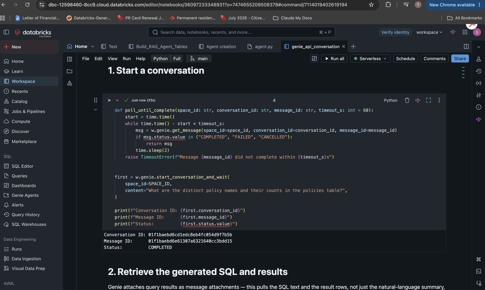
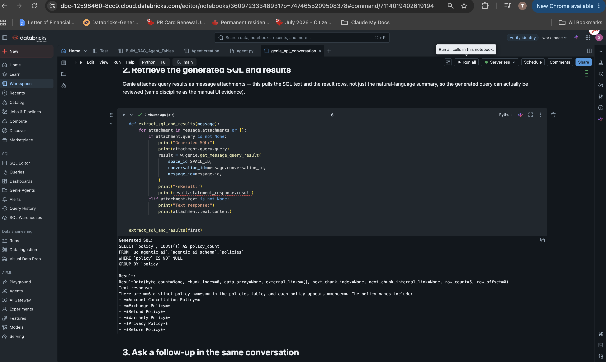
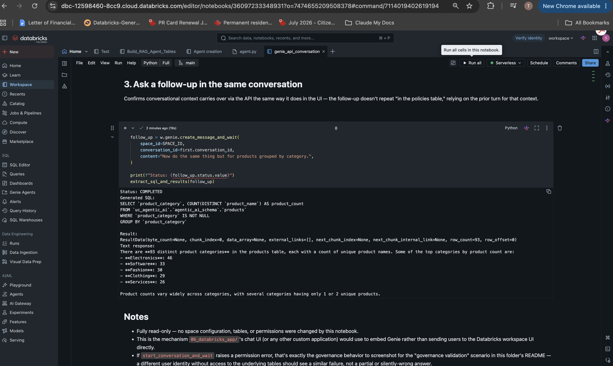
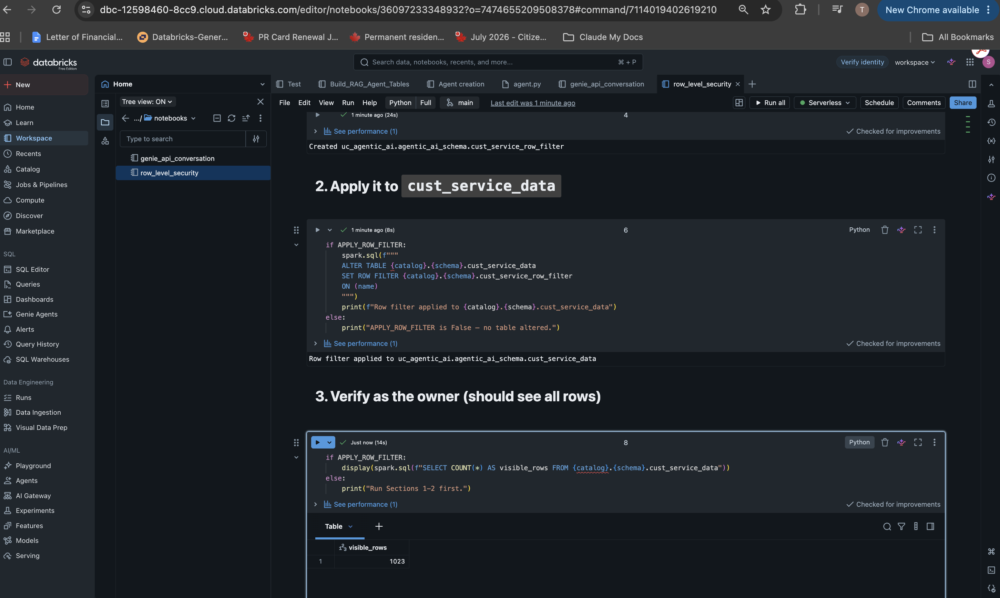
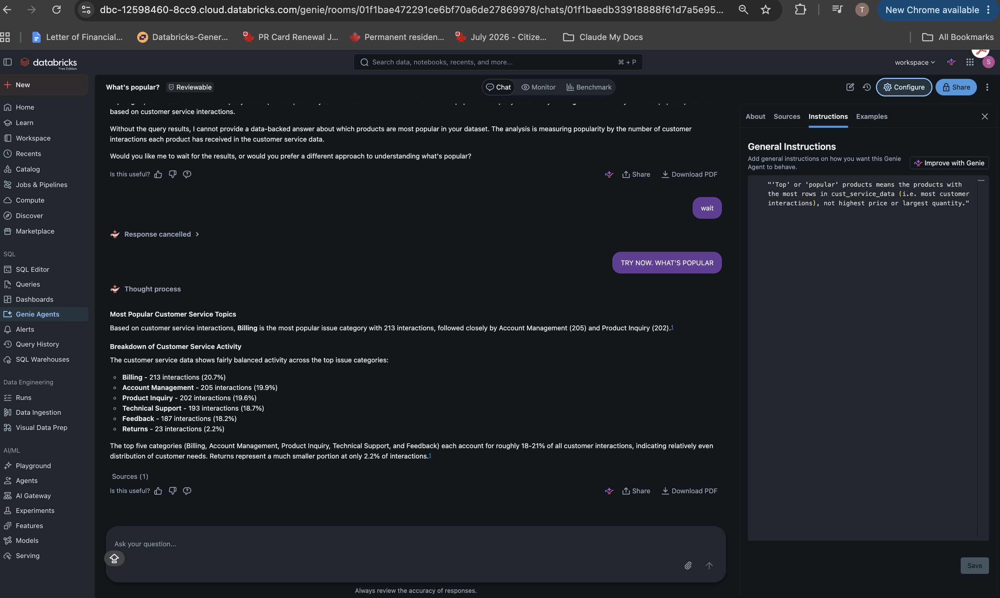
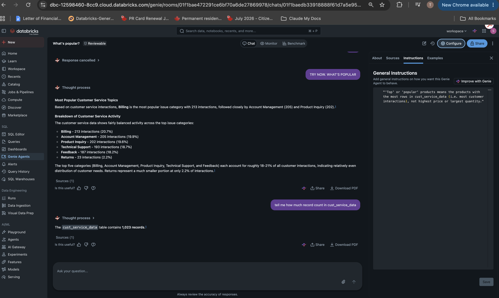

# Databricks Genie Space: Product Catalog and Customer Service

## Purpose

This assignment builds a Databricks Genie Space for natural-language analytics. It deliberately uses a different use case from the Workforce Insights assistant in [`01_claude_code/`](../01_claude_code/) and the root [`CLAUDE.md`](../CLAUDE.md) — instead of ingesting new data, it reuses Unity Catalog tables that already existed in the workspace, to demonstrate discovery + governed analytics over existing assets.

## What's Here

- [`notebooks/genie_api_conversation.py`](notebooks/genie_api_conversation.py) — programmatic access to the Genie Space via the Conversation API (start a conversation, retrieve generated SQL/results, ask a context-carrying follow-up), no UI involved.
- [`notebooks/row_level_security.py`](notebooks/row_level_security.py) — a Unity Catalog row filter on `cust_service_data`, the governance-validation half of this assignment. Now applied live (see "How It Was Built" step 8).

## Data Source

Inspected read-only via the Unity Catalog REST API (`/api/2.1/unity-catalog/catalogs|schemas|tables`) before building anything, per this repo's engineering standard of not guessing workspace-specific identifiers.

Catalog: `uc_agentic_ai` · Schema: `agentic_ai_schema`

| Table | Columns | Role |
|---|---|---|
| `products` | product_id, product_name, product_category, product_sub_category | Core product catalog (551 products, 93 categories) |
| `product_master` | product_id, product_name, product_category, product_sub_category, product_desc, product_combined | Extended product info, joins to `products` on `product_id` |
| `product_details` | product_name, product_desc | Product descriptions, joins on `product_name` (not `product_id`) |
| `product_index` | `__db_product_combined_vector` + product fields | Vector search index over products |
| `policies` | policy, policy_details, last_updated | Support/return policy text |
| `cust_service_data` | customer_id, name, email, phone_number, address, interaction_id, date_time, issue_category, issue_description, agent_id | Customer support interactions — confirmed synthetic/demo data before inclusion, since it has PII-shaped columns |

## How It Was Built

1. **Discovery (read-only).** Queried the Unity Catalog REST API with a PAT to list every catalog/schema/table in the workspace, rather than guessing. Found the workforce CSVs from `shared_data/` had never been ingested, and that `uc_agentic_ai.agentic_ai_schema` had a ready-made product/customer-service dataset.
2. **PII check.** `cust_service_data` has name/email/phone/address columns. Flagged this before use; confirmed with the data owner that it's synthetic demo data, not real customers, before including it in the space.
3. **Space creation.** In the Databricks UI: **Genie Agents → New Genie Space**, attached the Serverless Starter Warehouse, and added all 5 tables above (`products`, `product_master`, `product_details`, `policies`, `cust_service_data`). Named it **"Product Catalog and Customer Service."**
4. **Natural-language Q&A, verified against generated SQL.**
   - Asked: *"What are the distinct policy names and their counts in the policies table?"* → Genie correctly returned all 6 distinct policies (Warranty, Privacy, Account Cancellation, Refund, Exchange, Return), each with 1 record.

     

   - Asked a follow-up: *"list the products and count based on category and draw a visualisation."* Genie generated and ran real SQL against `uc_agentic_ai.agentic_ai_schema.products` — the SQL was inspected before trusting the result, not just the natural-language summary:

     ```sql
     SELECT
       `product_category`,
       COUNT(*) as product_count
     FROM
       `uc_agentic_ai`.`agentic_ai_schema`.`products`
     GROUP BY
       `product_category`
     ORDER BY
       product_count DESC
     ```

     

   - Full result set (93 distinct categories, 551 products total) with Genie's ranked summary of the top 5 categories (Electronics 46, Software 36, Fashion 30, Clothing 29, Services 27):

     

   - Genie auto-generated a bar chart visualization for the same result, on request, without needing to specify chart type manually:

     

5. **Confirmed persistence and ownership.** The space appears in the **Genie Agents** list, owned correctly, alongside pre-existing unrelated agents in the workspace (proof it wasn't accidentally created under a different identity or lost):

   

6. **Cross-checked with Genie One.** Databricks' cross-agent assistant (Genie One) was asked *"What tables are there and how are they connected? Give me a short summary."* — it independently derived the same schema and join relationships (4 product tables joined on `product_id`, `product_details` joined on `product_name` instead, plus the customer service and policy tables), confirming the space's table wiring is coherent and discoverable at a higher level:

   

7. **Programmatic access via the Genie Conversation API.** Ran `notebooks/genie_api_conversation.py` end to end, no UI involved: started a conversation (`start_conversation_and_wait`), pulled the generated SQL and result rows from the message attachment rather than trusting only the natural-language summary, then asked a follow-up in the same conversation and confirmed context carried over (it correctly answered "now do the same thing but for products grouped by category" without repeating "in the policies table").

   
   
   

8. **Row filter built and applied.** Ran `notebooks/row_level_security.py` with `APPLY_ROW_FILTER = True`: created `cust_service_row_filter` (owner sees all rows, everyone else sees none, keyed on `current_user()`), applied it to `cust_service_data` via `ALTER TABLE ... SET ROW FILTER`, and verified the owner's own query still returns all rows post-filter (1,023 visible rows) — proving the filter didn't accidentally lock out the owner along with everyone else.

   

9. **Break and fix.** Asked the space *"What's popular?"* before adding any defining instruction — Genie correctly refused to commit to an answer rather than guessing: *"Without the query results, I cannot provide a data-backed answer about which products are most popular... would you like me to wait, or a different approach?"* Then added the instruction *"'Top' or 'popular' products means the products with the most rows in `cust_service_data`... not highest price or largest quantity"* under Configure → Instructions and saved it. Re-asking the same question in the same conversation now produces a definitive, correctly-grounded breakdown by interaction count (Billing 213, Account Management 205, Product Inquiry 202, Technical Support 193, Feedback 187, Returns 23) — the ambiguity is gone because the term is now defined instead of left to the model to guess.

   

10. **Governance check, full access.** Asked the space *"tell me how much record count in cust_service_data"* as the table owner, post-filter — correctly returned all 1,023 records, confirming the row filter (step 8) doesn't accidentally restrict the owner's own access.

    

## Scenario Coverage

| Scenario | Status |
|---|---|
| 1. Build a Genie Space with metadata/instructions | Done — space built with 5 tables, instructions added and saved (see `07-space-instructions.png`). |
| 2. Break and Fix (ambiguous question → improve metadata → verify fix) | Done — see step 9 above. |
| 3. Governance Validation (two user identities, different access levels) | Row filter built, applied, and verified from the owner's side (step 8, step 10). **The second-identity half is a known, permanent limitation of this workspace** — this is a single-user Databricks workspace with no second identity available to grant restricted access to, so the "ask as a restricted user" half of this scenario cannot be completed here. Documented as an open item rather than silently skipped. |
| 4. Programmatic Access (Genie API) | Done — [`notebooks/genie_api_conversation.py`](notebooks/genie_api_conversation.py), using the real space ID (`01f1bae472291ce6bf70a6de27869978`, confirmed via `GET /api/2.0/genie/spaces`) to start a conversation, retrieve generated SQL, and ask a context-carrying follow-up, entirely through the SDK/REST API. |
| 5. Business Handoff documentation | Done — this README's "How It Was Built" section documents scope, datasets, and the PII decision on `cust_service_data`. |

### Known Open Item

**Governance Validation (restricted-identity half)** — this workspace has only one Databricks identity (the account owner's), so there's no second user or service principal to grant restricted `cust_service_data` access to and test against. The row filter itself is real and live (verified in step 8/10); what's untested is specifically its effect on a *different* principal, since none exists in this workspace to test with. If a second identity becomes available later, re-run the check described in `row_level_security.py` §4.

**Governance Validation** — the row filter is live on `cust_service_data`. What's left: (1) grant a second user/service principal `SELECT` on `uc_agentic_ai.agentic_ai_schema.cust_service_data`, and (2) have that identity ask the Genie Space a question touching `cust_service_data`. Screenshot both: your own (full-access) answer, and the restricted identity's response (should fail or return zero rows, not silently return everything). If a second identity isn't practical to set up right now, this scenario is honestly still open — say so rather than skip the screenshot silently.

## Notes and Caveats

- **`cust_service_data` now has a live row filter applied.** As of step 8 above, only the table owner sees rows from this table — every other principal (including `04_rag/`'s `get_customer_service_history` function and `05_agent_creation/`'s deployed agent, when queried by anyone other than the owner) will now see zero rows from it. This is expected and is the point of the filter, but it's a real behavior change to shared infrastructure, not scoped to this folder alone.
- Beyond that one filter, no other workspace writes happened outside the Genie Space UI flow itself (no DDL, no table changes) — this used existing governed tables as-is.
- The Databricks PAT used to run the read-only discovery queries was shared in chat during setup; it was never written into any file in this repo (`.mcp.json` still only has the read-only GitHub server) and should be rotated in Databricks (User Settings → Developer → Access tokens) since it appeared in plaintext in conversation history.
- `product_details` joining on `product_name` instead of `product_id` is a real data-modeling inconsistency in the source tables (not something this assignment introduced) — worth knowing if you extend this space, since a product renamed in one table won't match `product_details` anymore.
- Screenshots show the workspace hostname and numeric org id in the browser URL; no auth tokens or PATs are visible in any captured image.

## Evidence

See [`screenshots/`](screenshots/) for the full annotated list.
