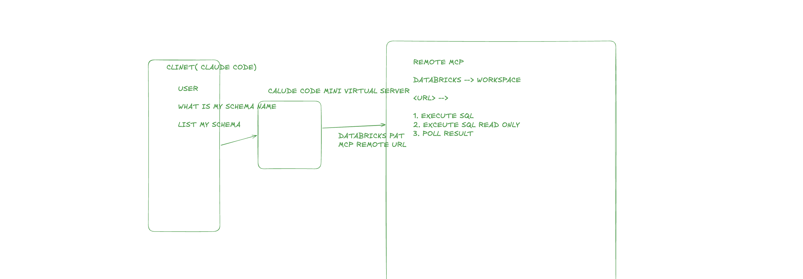
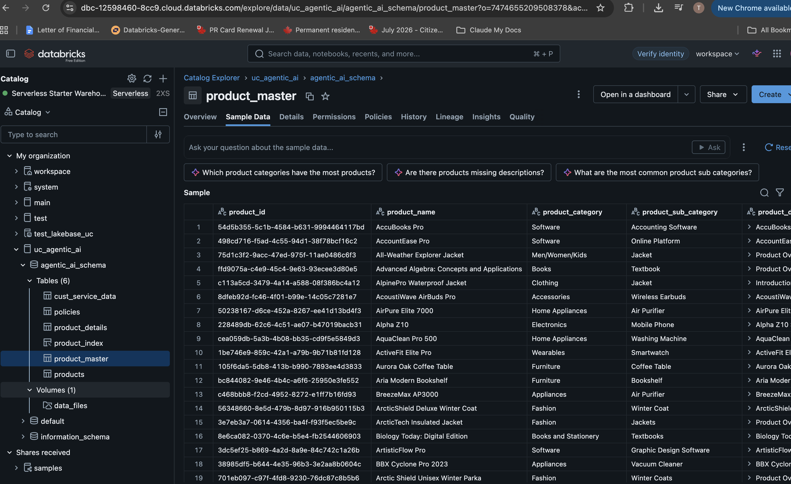
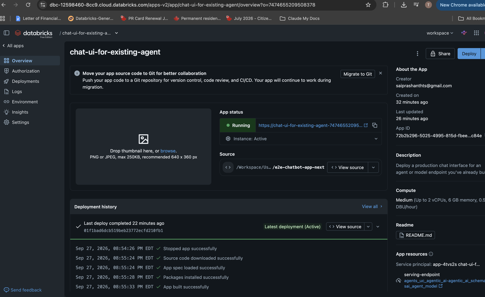

# FDE Evaluation

Six assignments building a Databricks-based agentic AI solution end to end: Claude Code workflows, conversational analytics, vector search, retrieval-augmented generation, a tool-calling agent, and a chat UI in front of it.

**[Open `architecture.html`](architecture.html) for the full end-to-end flow diagram** (download/clone and open in a browser — it's a self-contained page, no build step, dark-mode aware).

## Two Use Cases, By Design

**Assignment 1** implements a Workforce Insights and HR Policy Assistant over synthetic HR data (`shared_data/`) — see the root [`CLAUDE.md`](CLAUDE.md) for that product's full spec.

**Assignments 2–6** pivot to a product-catalog and customer-service dataset that already existed in the Databricks workspace (`uc_agentic_ai.agentic_ai_schema`), rather than ingesting the HR data into Unity Catalog. This was a deliberate choice, made and documented at the start of assignment 2: the workspace already had a ready-made dataset (`products`, `product_master`, `product_details`, `policies`, `cust_service_data`) worth demonstrating discovery and governed analytics over, instead of provisioning new tables from scratch. Every later assignment builds on that same dataset for consistency. `CLAUDE.md`'s "Repository Scope" section has the full explanation.

## Assignments

| Folder | What it covers |
|---|---|
| [`01_claude_code/`](01_claude_code/) | Claude Code workflows: slash commands, subagents, skills, MCP integration, and a real reproduce → diagnose → fix → verify bug fix (a silently-dropping SQL join, found by code review, fixed, and verified against synthetic edge-case data). |
| [`02_genie_space/`](02_genie_space/) | A Genie Space for natural-language analytics over the product/customer-service tables, programmatic access via the Genie Conversation API, a break-and-fix cycle on an ambiguous business term, and row-level governance (a real Unity Catalog row filter, applied live). |
| [`03_vector_database/`](03_vector_database/) | The Vector Search index behind the whole pipeline: how `product_master` was built from 509 parsed PDFs, health/freshness verification, filtered search, a Delta Sync vs. Direct Vector Access comparison, and `top_k` tuning — all run against the live index. |
| [`04_rag/`](04_rag/) | Retrieval-augmented generation: structured UC-function tools alongside unstructured vector retrieval, grounded answer generation, chunking-strategy tradeoffs, metadata-filtered retrieval, and hybrid vs. pure-semantic search — with a measured case where hybrid search meaningfully outperforms. |
| [`05_agent_creation/`](05_agent_creation/) | A deployed tool-calling agent (`sai_agent_model`) combining the vector index and both UC functions, evaluated with 4 scorers, traced end to end, and monitored live — including two real, documented findings about ungrounded answers when the agent's system prompt is empty. |
| [`06_databricks_app/`](06_databricks_app/) | A chat UI (Next.js, deployed as a Databricks App) fronting the deployed agent, with tool calls shown inline so a user can see what the agent retrieved before trusting its answer. |

Each folder's own `README.md` documents what was actually built, why, and any known gaps or design decisions — those are the authoritative source for that assignment, not this file.

## Repository Layout

```
architecture.html              End-to-end flow diagram — open in a browser
CLAUDE.md                      Product spec for the Workforce Insights use case + repo-wide standards
shared_data/                   Synthetic HR tables and documents (assignment 1's data)
product_catalog_data/          Raw source data behind uc_agentic_ai.agentic_ai_schema (assignments 2–6's data)
lightweight_evidence_3_4_5.py  Zero-install REST/SQL notebook covering core evidence for assignments 3–5
lightweight_evidence_batch2.py Companion notebook covering the remaining assignment 3/4 scenarios
01_claude_code/                Claude Code workflow evidence
02_genie_space/                Genie Space + notebooks + evidence
03_vector_database/            Vector Search notebooks + evidence
04_rag/                        RAG notebooks + evidence
05_agent_creation/             Agent notebooks + evidence
06_databricks_app/             Chat UI app code + evidence
```

Every assignment folder follows the same internal pattern: a `README.md` explaining what was built and how, a `notebooks/` folder (where applicable) with the actual Databricks notebooks, and a `screenshots/` folder with a checklist README plus the captured evidence.

The two `lightweight_evidence_*.py` notebooks at the repo root exist because of a real constraint worth being upfront about: this was built against a free-tier Databricks workspace with limited serverless compute quota, where the standard `%pip install`-heavy notebooks repeatedly hit capacity limits. Both notebooks produce the same evidence using only `spark.sql(...)` and direct REST calls — no package installs — and are what actually generated most of the assignment 3/4/5 screenshots in this repo. The heavier, fully-featured notebooks (`03_vector_database/notebooks/03_advanced_scenarios.py`, `04_rag/notebooks/03_chunking_tradeoffs.py`, etc.) still exist and are the "proper" versions; the lightweight ones were the pragmatic path to real evidence under real constraints.

## Working Conventions

- **Nothing is guessed.** Every catalog, schema, table, index, endpoint, and model name referenced anywhere in this repo was confirmed against the live Databricks workspace via read-only API calls before being used — not assumed from documentation or memory.
- **Cloud writes are gated.** Anything that creates or modifies workspace state (schemas, tables, indexes, permissions, deployments) is either already-approved and documented as such, or disabled by default in its notebook (an explicit flag like `RUN_INDEX_CREATION = False`) pending deliberate review.
- **Gaps are flagged, not hidden.** Where something is thin, missing, or a real discrepancy between what was planned and what's actually live, it's called out directly in the relevant README rather than glossed over — including genuine findings discovered while running notebooks (e.g. the deployed agent's missing system prompt, or an evaluation scorer that doesn't apply to every row).
- **Screenshots are evidence, not decoration.** Each `screenshots/README.md` maps exact filenames to exact evidence; only genuine session results go in, no placeholders.

## Databricks App Walkthrough: Product Assistant

The full picture, end to end: a Unity Catalog vector index and two UC functions wired up as tools for an LLM agent, the agent registered and deployed to a Model Serving endpoint, and a Databricks App (chat UI) deployed in front of it for end users. This section walks through it visually — the underlying app code lives in [`06_databricks_app/app/`](06_databricks_app/app/), and every image below is a real capture from the live workspace, also indexed in [`06_databricks_app/screenshots/`](06_databricks_app/screenshots/).

### Architecture


```
PDF ──► Volumes ──► RAG ──► Vector Search endpoint ──► Vector index ─┐
                                                                      │
data files (csv/txt) ──► Delta table ──► UC function ────────────────┤
                                                                      ▼
                                                          AI Agent (LLM + tools)
                                                          1. Vector index (product_index)
                                                          2. UC functions (policy, customer data)
                                                                      │
                                                                      ▼
                                                        Register + Deploy (MLflow)
                                                                      │
                                                                      ▼
                                                             Model Serving endpoint
                                                                      │
                                                                      ▼
                                                          Databricks App (chat UI)
```

The agent has three tools available to it at inference time:

1. **Vector search** over `product_index` — semantic retrieval of product info.
2. **UC function 1** (`get_policy_details`) — answers return/shipping/warranty policy questions.
3. **UC function 2** (`get_customer_service_history`) — answers order/customer lookups.

### Data Pipeline: Building the Product Knowledge Base


Two source tables are combined into a single denormalized `product_master` table, which is then synced to a Databricks Vector Search index — the same pipeline documented in detail in [`03_vector_database/`](03_vector_database/):

| Source | Columns |
|---|---|
| `products` | `product_id`, `product_name`, `product_category`, `product_sub_category` |
| `product_details` (parsed from 509 product PDFs) | `product_name`, `product_desc` |

Joined into **`product_master`**: `product_id`, `product_name`, `product_category`, `product_sub_category`, `product_desc`, and `product_combined` — an XML-tagged text column used as the embedding source for the vector index.

`product_master` is synced (Delta Sync, triggered) into the **`product_index`** Vector Search index, served by `ai_search_endpoint`.

### Tools: Unity Catalog Functions



| Source | UC function | Purpose |
|---|---|---|
| `policies` table | `get_policy_details` | Answers policy questions (returns, shipping, warranty) |
| `cust_service_data` table | `get_customer_service_history` | Looks up customer/order data |

Both functions, plus the `product_index` vector index, are registered as tools on the deployed agent — see [`04_rag/`](04_rag/) for why these are structured-lookup tools rather than vector search, and [`05_agent_creation/`](05_agent_creation/) for how the agent decides which to call.

### Unity Catalog Layout

Everything lives under a single UC schema, `uc_agentic_ai.agentic_ai_schema`:



| Object | Type | Notes |
|---|---|---|
| `products` | Table | Raw product name/description |
| `product_details` | Table | Parsed PDF descriptions (509 rows) |
| `product_master` | Table | Denormalized product table (source for the vector index) |
| `product_index` | Vector index | 553 rows, Delta Sync, Hybrid, online |
| `policies` | Table | Source for `get_policy_details` |
| `cust_service_data` | Table | Source for `get_customer_service_history` (confirmed synthetic — see `product_catalog_data/README.md`) |
| `data_files` | Volume | Raw file landing zone (PDFs, csv) |

`product_master` sample data — structured columns and the combined embedding column used by the vector index:


Querying the deployed index directly (hybrid search over `product_combined`):


### Agent: Register, Deploy, Serve

The agent (`sai_agent_model`) is registered via MLflow and deployed as a Model Serving endpoint (`agents_uc_agentic_ai-agentic_ai_schema-sai_agent_model`, task: **Agent (Responses)**) — full evaluation, tracing, and monitoring results are in [`05_agent_creation/`](05_agent_creation/).


### Chat UI: Databricks App

The serving endpoint is fronted by a Databricks App chat UI ([`06_databricks_app/app/`](06_databricks_app/app/)), pointed at the deployed agent endpoint.


In the chat, tool calls the agent makes (e.g. a `product_index` vector search) are shown inline with their parameters and raw results, so you can see exactly what the agent retrieved before it answers:


### Ad-Hoc Querying via Claude Code + a Databricks MCP Server

For local development/debugging, the workspace also exposes a remote MCP server (SQL execute / read-only execute / poll result) that Claude Code can connect to directly using a Databricks PAT — useful for quick "what's my schema" / "list my tables" style questions against the workspace without leaving the terminal.


