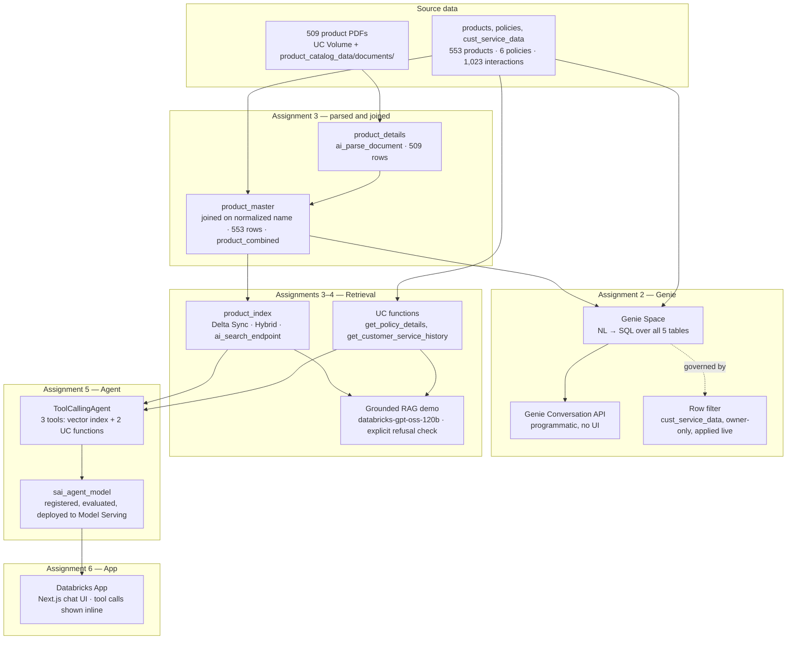

# End-to-End Architecture

Two tracks, six assignments. Track A (assignment 1) demonstrates Claude Code workflow practices against the Workforce Insights HR data. Track B (assignments 2–6) is one continuous pipeline: raw product data becomes governed tables, a vector index, a retrieval-augmented agent, and a chat UI, over the same live Unity Catalog objects throughout.

## Track A — Assignment 1: Claude Code Workflows

Slash commands, subagents, skills, and MCP integration applied to `shared_data/` (synthetic employees/departments CSVs, HR onboarding & leave-request guides) — the Workforce Insights product this repo's [`CLAUDE.md`](CLAUDE.md) describes. Independent of Track B; establishes the working practices (verify before writing, flag gaps, reproduce → diagnose → fix → verify) carried through the rest of the repo.

| Step | What happened |
|---|---|
| Onboarding validation | CSV/schema checks via a packaged skill |
| Metric clarified | Active headcount definition confirmed before encoding |
| Data contract + UC proposal | Proposal only — not executed against a workspace |
| Code review → real fix | Silent-drop JOIN bug found and fixed, verified with a synthetic test |
| GitHub MCP | Connected, read-only query confirmed working |

## Track B — Assignments 2–6: Product Catalog Pipeline

All on `uc_agentic_ai.agentic_ai_schema` — a pre-existing dataset discovered read-only before assignment 2 began, reused instead of ingesting new data. Raw source files (509 PDFs, the 3 CSVs) are preserved locally in [`product_catalog_data/`](product_catalog_data/).

### Real findings, documented not silently patched

> **Missing system prompt.** The deployed agent has no system prompt. An off-domain question got answered ("Paris") instead of declined, and with its vector-search tool unavailable it answered a product question from general LLM knowledge instead of erroring. The standalone RAG demo (assignment 4), which does have a grounding prompt, declines correctly in both cases. See [`05_agent_creation/README.md`](05_agent_creation/README.md).

> **Evaluation scorer applicability.** Agent evaluation's `RetrievalGroundedness`/`RetrievalRelevance` scorers only apply cleanly to the 3 of 10 test questions that hit the vector index — the 7 that used UC functions show `Error`, not pass/fail, since there's no retrieval span to score. See [`05_agent_creation/README.md`](05_agent_creation/README.md#evaluation-results).

> **Scope note.** The agent has no Genie tool — it can't answer aggregate questions ("how many products in Electronics?") that `product_index` alone can't serve.

## Where Each Piece Lives

| Stage | Folder |
|---|---|
| Source data | [`product_catalog_data/`](product_catalog_data/) |
| Genie Space, row governance | [`02_genie_space/`](02_genie_space/) |
| Vector index build & verification | [`03_vector_database/`](03_vector_database/) |
| Retrieval tools & grounded generation | [`04_rag/`](04_rag/) |
| Deployed agent, evaluation, tracing, monitoring | [`05_agent_creation/`](05_agent_creation/) |
| Chat UI | [`06_databricks_app/`](06_databricks_app/) |

See each assignment's own `README.md` for full detail, screenshots, and scenario coverage.
